# aws-ses-relay

[](https://github.com/JeronimoColon/aws-ses-relay/actions/workflows/ci.yml)
[](https://github.com/JeronimoColon/aws-ses-relay/actions/workflows/codeql.yml)
[](https://github.com/JeronimoColon/aws-ses-relay/releases/latest)
[](LICENSE)

A single AWS Lambda function, written in Rust, that forwards inbound email
received by Amazon SES. SES receives mail for a domain you control, stores the
raw message in S3, and invokes this function; the function reads the raw bytes
from S3, rewrites the headers so SES will accept the message for sending, and
re-sends it to the destination(s) you configure. It is configured entirely by
environment variables - no addresses, domains, or bucket names are ever written
into the source.

> **Its standout feature is [the verdict gate](#the-verdict-gate):** fail-open
> with visibility. A confirmed virus is the only unconditional drop - everything
> uncertain is *forwarded* rather than silently lost, and every questionable
> forward is logged as a `WARN` you can alarm on.

> **Deploying?** Follow the ordered, copy-paste runbook in
> **[docs/DEPLOY.md](docs/DEPLOY.md)** - from a bare account to a working
> forwarder, with ready-to-apply IAM and S3 policy files. The sections below are
> the reference that explains *what* each piece does and *why*.

## How it works

<picture>
  <source media="(prefers-color-scheme: dark)" srcset="docs/diagrams/how-it-works-dark.svg">
  
</picture>

SES will not send "from" a domain you do not control, so the function rewrites
each message before re-sending:

- **`From`** is rewritten to your verified sender address, preserving the
  original display name.
- **`Reply-To`** is set to the original `From` (unless the message already has a
  `Reply-To`, or the original `From` is empty), so replies reach the real sender.
- **`Return-Path`**, **`Sender`**, **`Message-ID`**, and every
  **`DKIM-Signature`** are removed (SES sets its own; the inherited DKIM
  signatures no longer match the rewritten message).
- Optionally, a prefix is prepended to the **`Subject`**.

The message body is preserved exactly, byte for byte. Header parsing is a linear
byte scan - non-UTF-8 mail is never corrupted, and there is no regular
expression that could backtrack catastrophically on a hostile message.

## The verdict gate

Before this function runs, SES can scan each inbound message for **spam** and
**viruses** and attach a *verdict* to each. The function reads both and decides,
in one pass, whether to **forward** the message or **drop** it. (A drop means: do
not forward, return success, and leave the S3 object in place - no bounce, no
error.)

The design is **fail-open with visibility**. The only thing dropped
unconditionally is a confirmed virus; everything uncertain is delivered by
default - because for a forwarder, silently losing legitimate mail is worse than
passing along a questionable message. But **every questionable forward is logged
as a `WARN`**, so the bypass is never silent and you can alarm on it. Two opt-in
switches let you tighten the gate.

<picture>
  <source media="(prefers-color-scheme: dark)" srcset="docs/diagrams/verdict-gate-dark.svg">
  
</picture>

| virus verdict | spam verdict | switches | result |
|---|---|---|---|
| `FAIL` | any | any | **Drop** - virus (always) |
| `PROCESSING_FAILED` | - | `DROP_UNSCANNED=true` | **Drop** - unscanned |
| - | `FAIL` | `DROP_SPAM=true` | **Drop** - spam |
| `PASS` / `GRAY` / `PROCESSING_FAILED` / `DISABLED` / absent | - | defaults | **Forward** |
| forwarded with any non-`PASS`, non-`DISABLED` verdict | | | **Forward + `WARN`** |

- **`DROP_SPAM`** (default off) - drop on a spam `FAIL`.
- **`DROP_UNSCANNED`** (default off) - **fail closed**: drop when the *virus*
  scan could not run (`PROCESSING_FAILED`) rather than forward an unscanned
  message.

Scanning must be enabled on the SES receipt rule for verdicts to mean anything;
otherwise every status is `DISABLED` and nothing is dropped.

## Design notes

The function processes each event in a fixed order and does the cheap checks
first - an unmatched or dropped message returns without ever calling S3 or SES:

<picture>
  <source media="(prefers-color-scheme: dark)" srcset="docs/diagrams/processing-sequence-dark.svg">
  
</picture>

Rust was chosen deliberately: byte-level message handling means non-UTF-8 mail
cannot be corrupted; the header parser is linear-time, so a hostile message
cannot cause a catastrophic-backtracking denial of service; and the runtime has
the lowest memory footprint and fastest cold start, which gives the best
cost/concurrency profile if the project is adopted at high volume. (For a
low-volume forwarder, raw speed is irrelevant - the job is I/O-bound, spending
its time waiting on S3 and SES.)

## Setup

> **Two things bite first-time SES deploys and are easy to miss.** (1) Email
> *receiving* is only available in [certain
> regions](https://docs.aws.amazon.com/ses/latest/dg/regions.html#region-receive-email).
> (2) A new account's SES starts in the **sandbox**, where you can send only to
> pre-verified addresses at a low quota - so a forwarder delivers **nothing**
> until you [request production access](https://docs.aws.amazon.com/ses/latest/dg/request-production-access.html).
> Both are handled, in order, by the runbook in
> [docs/DEPLOY.md](docs/DEPLOY.md).

Create the S3 bucket and this Lambda in the **same region** as the SES receipt
rule.

1. **Verify your domain in SES** and publish the **MX record** it gives you so
   inbound mail is routed to SES.

2. **Create the S3 bucket** SES will write to. This bucket holds complete raw
   inbound emails, so treat it as sensitive:
   - Keep **Object Ownership = "Bucket owner enforced"** (the default) - this
     function uses no ACLs and relies on that setting.
   - Enable **S3 Block Public Access** on the bucket.
   - Add a bucket policy statement that **denies any request with
     `aws:SecureTransport = false`** (TLS-only access).
   - At-rest encryption: **SSE-S3** (the account default) is the intended
     control. **Do not enable KMS on the receipt rule's S3 action** - SES would
     envelope-encrypt the object and a plain `GetObject` would return ciphertext.

3. **Add a bucket policy** that lets SES write to the bucket. AWS provides the
   exact policy when you add the S3 action; it grants `s3:PutObject` to
   `ses.amazonaws.com` for your account and rule.

4. **Create the receipt rule** with an **S3 action** (to store the message)
   followed by a **Lambda action** (to invoke this function).

   > **Object key.** SES stores each message at an object key equal to its
   > `messageId`, optionally under a key prefix you set on the S3 action. This
   > function derives the object key from the event's `messageId`, so **leave
   > the S3 action's object key prefix empty**. (If an event does carry explicit
   > S3-action `bucketName`/`objectKey` fields, the function uses those instead,
   > and refuses any bucket other than `EMAIL_BUCKET`.)

## Configuration

All configuration is via environment variables. Invalid configuration fails the
cold start and reports **every** problem at once.

| Variable | Required | Default | Description |
|---|---|---|---|
| `FROM_EMAIL` | yes | - | The verified-domain address all forwarded mail is sent as. Rejected at startup if it contains whitespace or control characters. |
| `EMAIL_BUCKET` | yes | - | The S3 bucket SES writes inbound mail to. Also an allowlist: the function refuses to read from any other bucket. |
| `FORWARD_MAPPING` | yes | - | JSON object mapping match keys to non-empty arrays of destination addresses (see below). A single key may map to at most 50 destinations (the SES per-send cap). |
| `SUBJECT_PREFIX` | no | none | Prepended to the `Subject` when non-empty (e.g. `"[EXT] "` - include the trailing space you want). Rejected at startup if it contains control characters. |
| `ALLOW_PLUS_SIGN` | no | `true` | When `true`, a `+tag` suffix on the recipient mailbox is stripped before matching (`info+sales@...` matches as `info@...`). Accepts only `true`/`false`, case-insensitive. |
| `DROP_SPAM` | no | `false` | When `true`, messages whose spam verdict is `FAIL` are dropped. Accepts only `true`/`false`, case-insensitive. |
| `DROP_UNSCANNED` | no | `false` | When `true`, messages whose virus verdict is `PROCESSING_FAILED` (the scan could not run) are dropped - failing closed instead of forwarding an unscannable message. Accepts only `true`/`false`. |
| `IDEMPOTENCY_BUCKET` | no | none | When set, enables duplicate suppression (see [Idempotency](#idempotency)). Markers are written to this bucket; it may be `EMAIL_BUCKET` or a separate bucket. |

### `FORWARD_MAPPING`

A JSON object string. Keys are match keys (lowercased automatically); values are
non-empty arrays of destination addresses. Keys are matched in this precedence,
first match wins:

1. a full address - `"user@example.com"`
2. a whole domain - `"@example.com"` (any mailbox at that domain)
3. a bare mailbox - `"info"` (that mailbox at any domain)
4. `"@"` - catch-all for anything not matched above

```json
{
  "info@example.com": ["ops@example.net"],
  "@example.com":     ["catch-all@example.net"],
  "@":                ["fallback@example.net"]
}
```

> **Size limit.** Lambda caps total environment variables at 4 KB, which bounds
> how large `FORWARD_MAPPING` can be.

> **`DROP_SPAM`/`DROP_UNSCANNED`** only bite when scanning is enabled on the SES
> receipt rule; otherwise every verdict is `DISABLED` and nothing is dropped. See
> **[The verdict gate](#the-verdict-gate)** for the full drop/forward logic and
> the fail-open-with-`WARN` design.

## Least-privilege IAM

The function's execution role needs only:

- **`s3:GetObject`** on the inbound objects, e.g.
  `arn:aws:s3:::YOUR_INBOUND_BUCKET/*` (scope to your key prefix if you use one).
- **`ses:SendRawEmail`** on `arn:aws:ses:YOUR_REGION:YOUR_ACCOUNT_ID:identity/*`.
  The function sends via the SESv2 `SendEmail` API with a **raw** message, and at
  runtime AWS authorizes that against **`ses:SendRawEmail`** - verified against a
  live send. (The AWS action tables suggest `ses:SendEmail`, but only
  `ses:SendRawEmail` actually works for a raw send; granting `ses:SendEmail`
  alone fails with `AccessDenied` on the first message.)

  > `identity/*` is a permissive resource that works everywhere, **including the
  > SES sandbox**. Once you have **production** sending access you can tighten it
  > to your verified sender identity's ARN - for a **domain** identity that is
  > `arn:aws:ses:YOUR_REGION:YOUR_ACCOUNT_ID:identity/YOUR_DOMAIN` (it authorizes
  > sending as any address at that domain, including `FROM_EMAIL`). **In the
  > sandbox that is not enough:** SES also authorizes the send against each
  > verified *recipient* identity, so a sender-only scope fails with
  > `AccessDenied` naming a recipient ARN. While sandboxed, either keep
  > `identity/*` or list the sender identity plus every verified recipient
  > identity ARN.

- **CloudWatch Logs** write (`logs:CreateLogGroup`, `logs:CreateLogStream`,
  `logs:PutLogEvents`) - covered by the AWS-managed
  `AWSLambdaBasicExecutionRole`.
- If idempotency is enabled: **`s3:PutObject`** and **`s3:DeleteObject`** on the
  `idempotency/*` prefix of `IDEMPOTENCY_BUCKET`.

### Who may invoke the function

The execution role above governs what the function *does*. Equally important is
who may *trigger* it - the function's resource-based (invoke) policy. The
handler trusts any well-formed event it receives, so scope invocation tightly:
grant SES permission and nothing else.

```sh
aws lambda add-permission \
  --function-name aws-ses-relay \
  --statement-id AllowSESInvoke \
  --action lambda:InvokeFunction \
  --principal ses.amazonaws.com \
  --source-account YOUR_ACCOUNT_ID \
  --source-arn arn:aws:ses:YOUR_REGION:YOUR_ACCOUNT_ID:receipt-rule-set/YOUR_RULE_SET:receipt-rule/YOUR_RULE
```

Do not grant `lambda:InvokeFunction` to any other principal.

## Idempotency

SES invokes Lambda **at least once**: a lost response or a termination after a
successful send can deliver the same message twice, and without protection the
function forwards it twice. Set `IDEMPOTENCY_BUCKET` to enable suppression:

- On each message the function conditionally creates a marker object at
  `idempotency/<messageId>` using S3's atomic `If-None-Match` write. A duplicate
  finds the marker already present and is skipped (a drop, not an error). If the
  forward fails, the marker is deleted so a retry can re-process the message.
- The marker bucket may be `EMAIL_BUCKET` itself or a **separate bucket** (a
  separate bucket keeps the mail bucket single-purpose).
- Add an **S3 lifecycle rule** expiring the `idempotency/` prefix so markers do
  not accumulate **and so an orphaned marker self-heals**. Choose an expiry that
  comfortably exceeds SES's retry window but is not indefinite (e.g. a few days).
- When `IDEMPOTENCY_BUCKET` is unset the function behaves as plain
  at-least-once - a duplicate delivery may forward twice.

**Edge cases (this is at-least-once, not exactly-once).** The S3 single-marker
store closes the common duplicate cases but has two documented limits:

- **Ambiguous send → possible duplicate.** If SES accepts the message but the
  response is lost, the send is seen as failed, the marker is released, and the
  retry sends again. True exactly-once is not achievable at the SES boundary.
- **Crash after claim → possible suppressed retry.** If the function is killed
  after claiming but before sending (or the marker release itself fails during
  an outage), the marker persists; SES's retry then sees it as a duplicate and
  drops the message. The lifecycle-rule TTL above bounds this - once the marker
  expires, the message can be replayed. Release failures are logged at
  **error** level so they are alarmable.

> A **DynamoDB-backed** store (native TTL, plus a two-state "claimed vs.
> completed" marker) is the upgrade path to tighter guarantees; the store is
> isolated behind a trait so it can be swapped without touching the handler.

## Testing

Unit tests live inline in each module (`#[cfg(test)]`), so no extra setup is
needed:

```sh
cargo test
```

CI also enforces a line-coverage floor. To reproduce that check locally, install
the tooling once (`rustup component add llvm-tools-preview`, then `brew install
cargo-llvm-cov` or `cargo install cargo-llvm-cov`), then run:

```sh
# Fails if line coverage drops below 90%. src/main.rs (the Lambda bootstrap
# wiring) is excluded: it needs the live runtime and is exercised by an
# integration/container test, not unit tests. Everything else runs ~94%.
cargo llvm-cov --fail-under-lines 90 --ignore-filename-regex 'main\.rs$'
```

## Build and deploy

> This is the quickstart for the build/deploy step only. For the **complete**
> from-scratch procedure - S3 bucket, IAM role, SES rule wiring, and a smoke
> test - follow **[docs/DEPLOY.md](docs/DEPLOY.md)**.

Building needs the Rust stable toolchain, the `aarch64-unknown-linux-gnu`
target, `cargo-lambda`, and `zig` (the exact pinned versions are in
[`.github/workflows/release.yml`](.github/workflows/release.yml)). No Docker
required. Or skip building entirely and download a release artifact (see
[Releases](#releases)).

```sh
# Cross-compile for the Lambda runtime (ARM64, no Docker required).
cargo lambda build --release --arm64

# Deploy (creates or updates the function).
cargo lambda deploy \
  --memory 512 --timeout 30 --region YOUR_REGION \
  --env-var FROM_EMAIL=relay@example.com \
  --env-var EMAIL_BUCKET=your-inbound-bucket \
  --env-var 'FORWARD_MAPPING={"@example.com":["you@example.net"]}'
```

The single-destination `FORWARD_MAPPING` above has no commas. For a realistic
mapping (multiple destinations or keys), the `aws lambda` + `--environment` JSON
form in [docs/DEPLOY.md](docs/DEPLOY.md) encodes the value unambiguously and is
the authoritative path.

- **Runtime:** `provided.al2023` (OS-only). **Architecture:** ARM64 (Graviton).
- **Memory:** 256-512 MB (headroom for a large message held as bytes).
- **Timeout:** ~30 seconds.

> **`cargo lambda deploy` auto-creates a minimal execution role** with only
> CloudWatch Logs access - it will get `AccessDenied` on the first S3 read or
> SES send. For the correct least-privilege role, the bucket/SES wiring, and the
> resource-based invoke policy, use [docs/DEPLOY.md](docs/DEPLOY.md). You can
> also zip the produced `bootstrap` and upload it to a function you create
> yourself (also covered there).

## Releases

Pushing a `v*` tag runs the release workflow (`.github/workflows/release.yml`),
which gates on `cargo test`, cross-compiles the ARM64 binary, packages
`bootstrap-arm64.zip`, and attaches it (with a SHA-256 checksum) to a GitHub
Release for that tag. Tags containing a hyphen (for example `v0.1.0-rc.1`) are
published as pre-releases. Download the deployment package (run from a clone of
this repo so `gh` infers it, or add `--repo <owner>/aws-ses-relay`):

    gh release download <tag> --pattern 'bootstrap-arm64.zip'

## Failure handling

SES invokes Lambda **asynchronously**: on failure it retries twice and then
**drops the event**, while the message remains in S3. To avoid silently losing
mail:

- Configure an **OnFailure destination** (an SNS topic or SQS dead-letter
  queue) on the function's async invocation config, **or** at minimum a
  **CloudWatch alarm** on the function's `Errors` metric.
- To **replay** a failed message, re-invoke the function with an event that
  points at the stored S3 object. The event is parsed leniently - only the
  fields the function uses need be present - so a **minimal replay event** is
  enough:

  ```json
  {
    "Records": [{
      "eventSource": "aws:ses",
      "ses": {
        "mail": { "messageId": "THE_MESSAGE_ID" },
        "receipt": {
          "recipients": ["info@example.com"],
          "spamVerdict": { "status": "PASS" },
          "virusVerdict": { "status": "PASS" },
          "action": { "type": "Lambda" }
        }
      }
    }]
  }
  ```

  The object key is the message's `messageId`. Every event must carry a
  non-empty `messageId` made of letters, digits, `.`, `_`, or `-` (SES message
  ids satisfy this); the function rejects a missing or malformed one.

  With idempotency enabled, a replay of a message whose marker still exists is
  treated as a duplicate - it returns success and sends nothing. Delete
  `idempotency/<messageId>` from the marker bucket, or wait out its TTL, before
  replaying.

## Scaling to high volume

The real ceiling is your **SES sending quota** (messages per second and per
day) - request increases before you need them. Beyond that:

- Add a dead-letter queue so nothing is lost on failure.
- Optionally put an **SQS queue in front** of the function to smooth spikes and
  cap concurrency.
- Enable [idempotency](#idempotency) if duplicate deliveries would matter (SES
  async invokes are at-least-once).
- Tune memory for cost once you have real numbers.

## Operations

- Add an **S3 lifecycle rule** to expire stored mail after a retention period
  you choose. Dropped spam/virus mail also remains in the bucket, so lifecycle
  expiry is how you keep storage bounded.
- **Logging.** The function logs message ids, recipient counts/addresses,
  verdicts, and decisions as JSON - never message bodies or the raw event. Keep
  `RUST_LOG` at `info` in production; `debug`/`trace` can make the AWS SDK emit
  request metadata to CloudWatch. Inbound recipient addresses (your own
  verified-domain addresses) do appear in the logs, so set a **CloudWatch Logs
  retention policy** on the function's log group rather than the default
  never-expire.

## Limitations

- **40 MB post-base64 send cap.** SES caps a send at 40 MB after base64
  encoding, so this function refuses raw messages larger than ~30 MB.
- **Forwarding breaks SPF** (the envelope sender changes) and relies on DKIM
  alignment for DMARC. Deliverability depends on your verified domain's DKIM.
- **Watch for mail loops** with auto-responders: do not map `FROM_EMAIL` back
  into a forwarded destination.

## License

[MIT](LICENSE).
